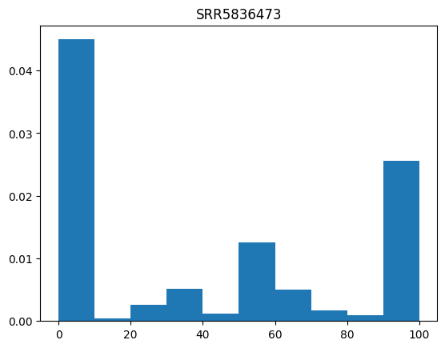
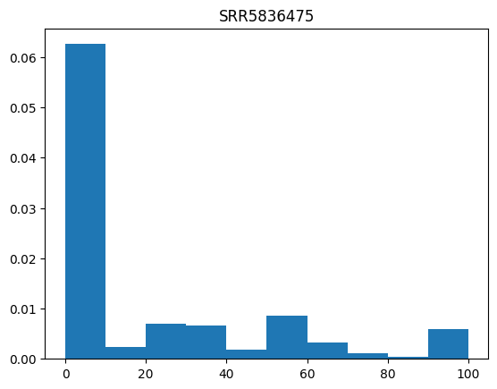
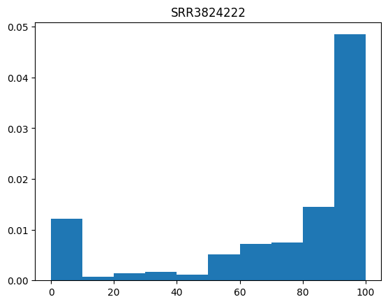
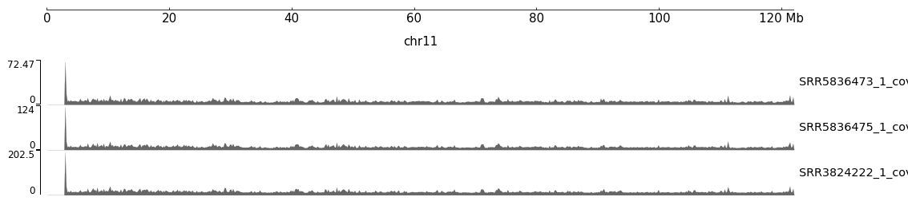

# hse24_hw1

## Егор Портнягин 3 группа

|          |            |
|----------|------------|
| 8 Cell   | SRR5836473 |
| ICM      | SRR5836475 |
| Epiblast | SRR3824222 |

### [блокнот](sol.ipynb)

Отчеты в формате .html:

* [8 Cell](data/SRR5836473_1_bismark_bt2_PE_report.html)
* [ICM](data/SRR5836475_1_bismark_bt2_PE_report.html)
* [Epiblast](data/SRR3824222_1_bismark_bt2_PE_report.html)

### Сколько закартировалось на регионы 11347700-11367700, 40185800-40195800 и процент дуплицированных прочтений:

|          | 11347700-11367700 | 40185800-40195800 | duplicated % |
|----------|-------------------|-------------------|--------------|
| 8 Cell   | 551               | 194               | 81.72        |
| ICM      | 797               | 274               | 90.93        |
| Epiblast | 1344              | 565               | 97.09        |

### Гистограммы распределения метилирования:

На гистограммах видно, что нет зависимости частоты  от процента метилированных цитозинов среди трёх образцов, для SRR5836473 в чуть больше 40% случаев метилируется 0%, для образца SRR5836475 в подавляющем большинстве случаев (>60%) тоже 0%, а для образца SRR3824222 в 50% метилируется 100%

### Уровень покрытия:

